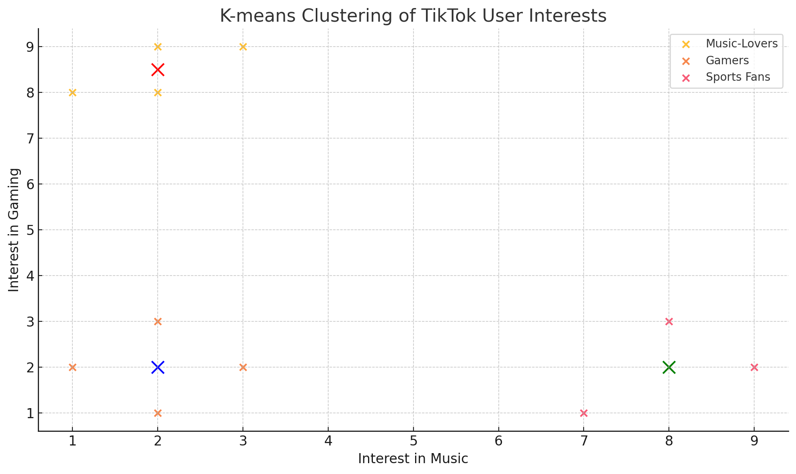

<!--
_paginate: false
_footer: Slides available at [`teaching.aditbala.com`](https://teaching.aditbala.com)
_class: lead invert
-->

# <!--fit--> EdSpire Lecture 00

###  Introduction to AI and Machine Learning

Aditya Balasubramanian and Saurav Suresh

---

<!-- 
_class: invert
_footer: 8/27/22
_backgroundColor: #2222
-->

## <!-- fit --> Announcements :mega:

---

## Agenda

<!--
_class: lead invert
-->

- About Us
- Icebreaker
- Logistics
- Lecture
- Q & A

---

## Aditya

* Currently: Software Engineer at Sigma Computing
* Previously: Berkeley Alumnus
* Major: Computer Science
* Origin: Maryland
* Hobbies:
  * Reading, Ping-Pong

---
## Saurav

* Currently: Senior at UC Berkeley
* Major: Computer Science & Math
* Origin: New Jersey
* Hobbies:
  * Weight-lifting, Reading

---

<!--
_class: lead invert
-->

## Logistics - Course

- Weekly Lecture
- Homework assigned every week
    - 1 hour of office hours every week (before/after lecture)
- Very important to do homework to stay on track

---

## Icebreaker

- Introduce yourselves with name, grade, pronouns
- Share one of your hobbies and one way that ML/AI has excited you

---

<!--
_class: lead invert
-->

## What is AI/ML?

* AI: trying to get a computer to act like a human
    * What are some real world examples of AI?
* ML: teaching computers to learn from tons and tons of data
    * What are some real world examples of ML?

---

<!--
_class: lead invert
-->

## A Short History of AI/ML

- Linear Regression
- K-Means Clustering
- Perceptron 
- Back-propagation
- AlexNet

---

<!--
_class: lead invert
-->

## 1800s: Linear Regression

- What is it?
    - `y = ax + b`
- Purpose?
    - originally created to predict comet orbits accurately (TODO)
- What are some other scenarios we use Linear Regression for?
    * Predict how a student’s SAT score rises with hours-studied
- What are some problems with this?
    *  can only catch linear trends, not something like stock prices

---

<!--
_class: lead invert
-->

## 1950s: K-Means Clustering

- What is it?
    - group data points into clusters
- Purpose?
    - simple fast way to group data points
- What are some other scenarios we use K-Means Clustering for?
    * Group TikTok users into “music-lovers”, “gamers”, “sports fans”
- What are some problems with this?
    *  need to guess `k`, sensitive to outliers
 

---

<!--
_class: lead invert
-->

## 1950s: Perceptron

- What is it?
    - Mathematical model that takes inputs and outputs either 1 ("yes") or 0 ("no")
- Purpose?
    - First step toward building artificial "brains"
- What are some scenarios we use Perceptrons for?
    * Email spam filters (spam or not spam)
- What are some problems with this?
    * Too simple for complex decisions (can't handle "it depends" situations)
 

---

<!--
_class: lead invert
-->

## 1980s: Back-propagation

- What is it?
    - Teaching a computer by showing it what mistakes it made
- Purpose?
    - Helps computers learn from their errors and get better over time
- What are some scenarios we use Back-propagation for?
    * Voice assistants understanding your commands
    * Netflix recommending shows you might like
- What are some problems with this?
    * Sometimes "forgets" earlier lessons when learning new things
    * Needs powerful computers and lots of examples to work well
- 

---

<!--
_class: lead invert
-->

## 2012: AlexNet

- What is it?
    - A super-powered computer system that can recognize what's in pictures
- Purpose?
    - To teach computers to "see" and understand images like humans do
- What are some scenarios we use AlexNet for?
    * Snapchat filters that know where your face is
    * Self-driving cars identifying pedestrians and stop signs
    * Medical apps that can spot diseases in X-rays
- What are some problems with this?
    * Needs thousands of example photos to learn properly
    * Uses so much computing power it can heat up your laptop!
- 

---

<!--
_class: default invert
-->

# An Overview of Language Models

* What is a language model?
  * Next word predictor
  * Natural language encoder/decoder
  * Probabilistic model of natural language

---

<!--
_class: default invert
-->

# Early Language Models

* One-Hot Key encoding
* Skip-Gram models
* Continuous Bag of Words model
* LSTM encoder-decoder

---

<!--
_class: default invert
-->

# Pros/Cons Early Models

* Word2Vec: robust vector embeddings for words
* Issues:
  * Limited context
  * Unidirectional
  * Not conversational

---

<!--
_class: default invert
-->

# Transformers

* Google's BERT
* Bidirectional: ingests input all at once and considers context before and after each word
* Context: ingests large number of tokens at once
* Conversational: later iterations use RL to make the model more conversational (i.e. ChatGPT)

---

<!--
_class: default invert
-->

# Transformer Architecture

* Self-Attention
* Parallelism
* Scalability

---

<!--
_class: default invert
-->

# Recent Developments

* Model Compression (DeepSeek)
* Multimodality
* Agents

---

<!--
_class: invert
-->

# Thank you!

### Homework 

 Explore and compare responses from different AI tools (ChatGPT, Claude, Bard). Write a two paragraph report about their similarities, differences, and potential uses.

