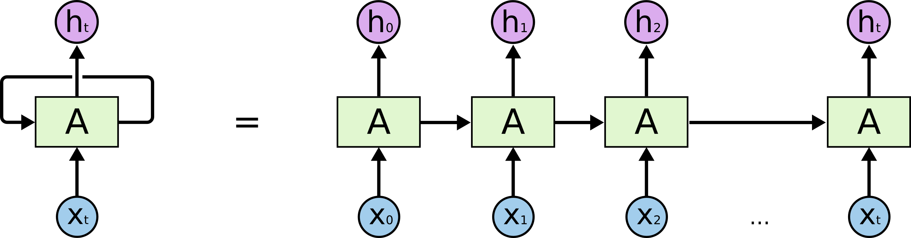

<!--
_paginate: false
_footer: Slides available at https://edspire.aditbala.com/docs/lesson1 
_class: lead invert
-->

# <!--fit--> EdSpire Lecture 01

###  Introduction to AI and Machine Learning

Aditya Balasubramanian and Saurav Suresh

---

<!-- 
_class: invert
_backgroundColor: #2222
-->

## <!-- fit --> Announcements :mega:

---

## Agenda

<!--
_class: lead invert
-->

- About Us
- Icebreaker
- Logistics
- Lecture
- Q & A

---

## Aditya

* Currently: Software Engineer at Sigma Computing
* Previously: Berkeley Alumnus
* Major: Computer Science
* Origin: Maryland
* Hobbies:
  * Reading, Ping-Pong

---
## Saurav

* Currently: Senior at UC Berkeley
* Major: Computer Science & Math
* Origin: New Jersey
* Hobbies:
  * Weight-lifting, Reading

---

<!--
_class: lead invert
-->

## Logistics - Course

- Weekly Lecture
- Homework assigned every week
    - 1 hour of office hours every week (before/after lecture)
- Very important to do homework to stay on track

---

## Icebreaker

- Introduce yourselves with name, grade, pronouns
- Share one of your hobbies and one way that ML/AI has excited you

---

<!--
_class: lead invert
-->

## What is AI/ML?

* AI: trying to get a computer to act like a human
    * What are some real world examples of AI?
* ML: teaching computers to learn from tons and tons of data
    * What are some real world examples of ML?

---

<!--
_class: lead invert
-->

## A Short History of AI/ML

- Linear Regression
- K-Means Clustering
- Perceptron 
- Back-propagation
- AlexNet

---

<!--
_class: lead invert
-->

## 1800s: Linear Regression

- What is it?
    * `y = ax + b`
- Purpose?
    * model relationships between dependent and independent variables
    * use Mean Squared Error (MSE) to minimize error
- What are some other scenarios we use Linear Regression for?
    * Predict how a student’s SAT score rises with hours-studied
- What are some problems with this?
    *  can only catch linear trends, not something like stock prices

---

<!--
_class: lead invert
-->

## 1950s: K-Means Clustering

- What is it?
    * group data points into clusters
- Purpose?
    * simple fast way to group data points
- What are some other scenarios we use K-Means Clustering for?
    * Group TikTok users into “music-lovers”, “gamers”, “sports fans”

- What are some problems with this?
    *  need to guess `k`, sensitive to outliers

 

---

<!--
_class: lead invert
-->

## 1950s: Perceptron

- What is it?
    * Mathematical model that takes inputs and outputs either 1 ("yes") or 0 ("no")
- Purpose?
    * First step toward building artificial "brains"
- What are some scenarios we use Perceptrons for?
    * Email spam filters (spam or not spam)
- What are some problems with this?
    * Too simple for complex decisions (can't handle "it depends" situations)

 

---

<!--
_class: lead invert
-->

## 1980s: Back-propagation

- What is it?
    * Teaching a computer by showing it what mistakes it made
- Purpose?
    * Helps computers learn from their errors and get better over time
- What are some scenarios we use Back-propagation for?
    * Handwritten Digit Recognition (MNIST)
    * Netflix recommending shows you might like
- What are some problems with this?
    * Sometimes "forgets" earlier lessons when learning new things
    * Needs powerful computers and lots of examples to work well
---

<!--
_class: lead invert
-->

## 2012: AlexNet

- What is it?
    * A super-powered computer system that can recognize what's in pictures
- Purpose?
    * To teach computers to "see" and understand images like humans do
    * Learn's iamge features
- What are some scenarios we use AlexNet for?
    * Image Classification (CIFAR, ImageNet)
    * Medical apps that can spot diseases in X-rays
- What are some problems with this?
    * Needs thousands of example photos to learn properly
    * Uses so much computing power it can heat up your laptop!

---

<!--
_class: default invert
-->

# An Overview of Language Models

* What is a language model?
  * Next word predictor
  * Natural language encoder/decoder
  * Probabilistic model of natural language

---

<!--
_class: default invert
-->

# Early Language Models

- One-Hot Key encoding
- Skip-Gram models
- Continuous Bag of Words model
- LSTM encoder-decoder

---

<!--
_class: default invert
-->

# One-Hot Key Encoding

- Given a set of n words, assigns unique vectors for each word
- EX: house, cat, dog
- house -> [1, 0, 0]
- cat -> [0, 1, 0]
- dog -> [0, 0, 1]
- Issues: arbitrary, not context aware, only word level, problems in higher dimensional space
  

---

<!--
_class: default invert
-->

# CBOW Model

- Typically uses one-hot key encodings
- Given context words, predicts the center word
- EX: Predict the missing word: "I am so hungry ____ now." 
- EX: Predict the missing word: "He twisted his ankle during practice, so he was _____ on his way home."
- EX: Predict the missing word: "So he was ___ on"
- Issue: cannot handle long, complex texts
  

---

<!--
_class: default invert
-->

# Skip-Gram Model

- Also commonly uses one-hot key encodings
- Given a word, predicts the context words
- EX: Predict the two missing words given: "____ hungry ____"
- Performs well on small datasets and better at handling rare words
- Issues: takes longer to train and similar context issues as CBOW
  

---

<!--
_class: default invert
-->

# Long Short Term Memory Model
- Uses one-hot key encodings or more advanced embeddings (i.e. Word2Vec)
- Recurrently handles sequential data
- Maintains an internal memory over a sequence
- EX: Predict the missing word: "I am so hungry right ____"
- Issues: Unidirectional, computationally expensive, struggles with long-term dependencies
  

---

<!--
_class: default invert
-->

# Successes and Failures of Early LMs
* Skip-gram and CBOW models used in Word2Vec
* Google's ELMo uses LSTMs
* Weak Points:
  * Not conversational
  * Limited input size
  * Relatively poor performance

---

<!--
_class: default invert
-->

# Transformers
- Introduced by Vaswani et al. in 2017 in pivotal paper: Attention Is All You Need
- Bidirectional
- Multi-headed self-attention mechanism (can handle long-term dependencies)
- Parallelizable (computationally cheaper)
  

---

<!--
_class: default invert
-->

# Large Language Models
- Following the success of transformers in various NLP tasks, it is scaled and trained on larger datasets
- Google's BERT and OpenAI's GPT-2 were early LLMs
- GPT-3 along with reinforcement learning from human feedback (RLHF) leads to ChatGPT
  

---

<!--
_class: default invert
-->

# Exciting Developments
- Model Compression (i.e., DeepSeek distilled models)
- Multimodality
- Agents

---

<!--
_class: invert
-->

# Thank you!

### Homework 

 Explore and compare responses from different AI tools (ChatGPT, Claude, Bard). Write a two paragraph report about their similarities, differences, and potential uses.

