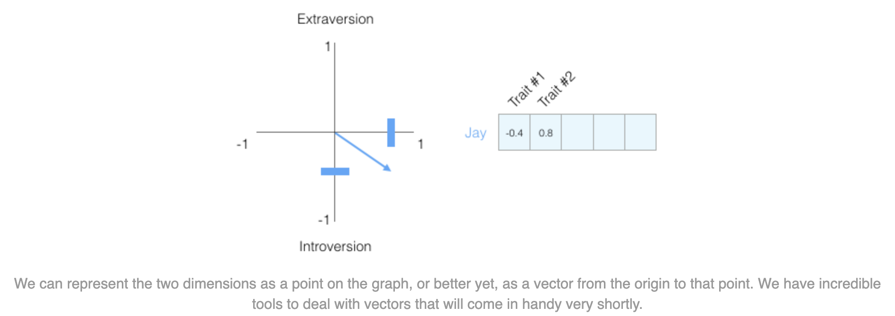
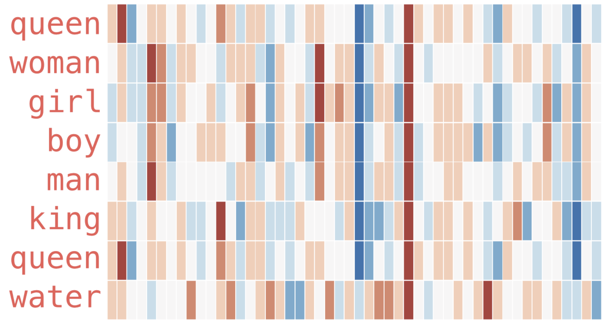
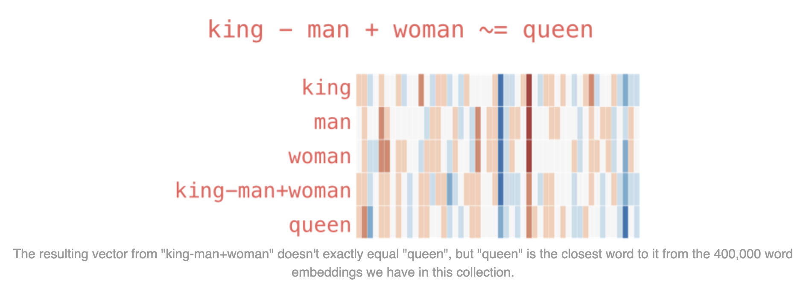
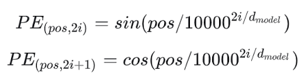
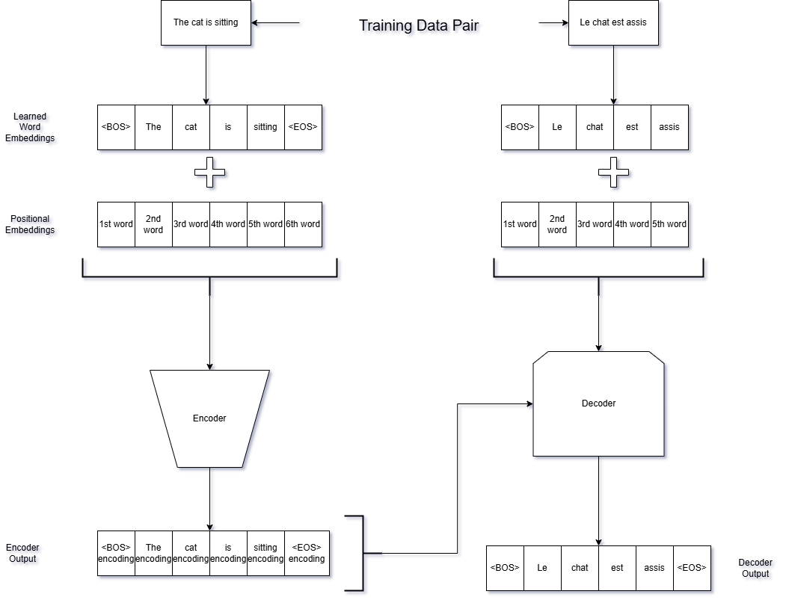
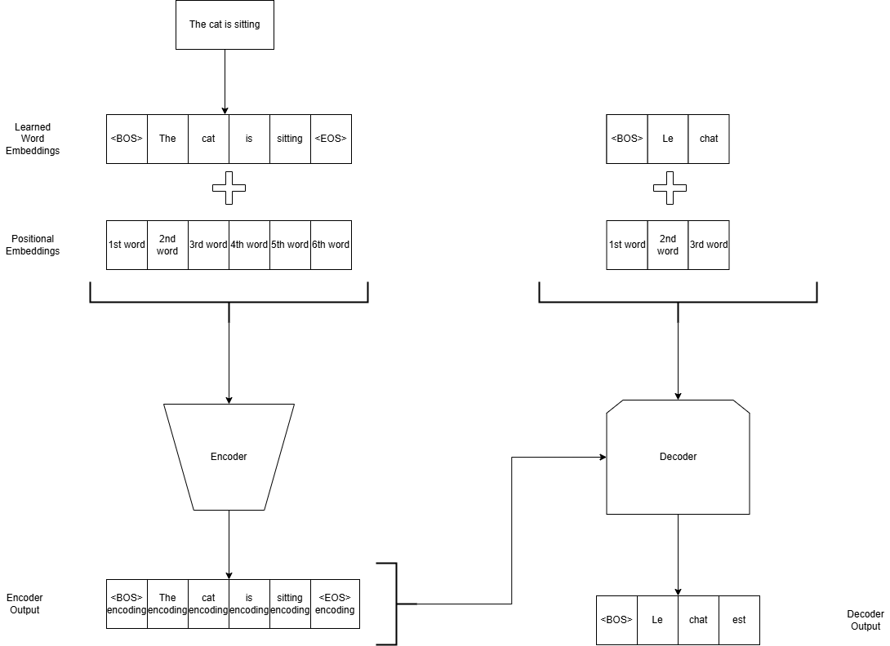

<!--
_paginate: false
_footer: Slides available at https://edspire.aditbala.com/docs/lesson3 
_class: lead invert
-->

# <!--fit--> EdSpire Lecture 03

###  Deep Dive into LLMs

Aditya Balasubramanian and Saurav Suresh

---

# Embeddings

- How do machines represent text?

--- 

## One-Hot Encoding

- Assign a unique vector to each word
- EX: house, cat, dog
- house -> [1, 0, 0]
- cat -> [0, 1, 0]
- dog -> [0, 0, 1]
- Issues: arbitrary, not context aware, only word level, problems in higher dimensional space


---

<!--
_footer: source: https://jalammar.github.io/illustrated-word2vec/
-->

## Word2Vec

* Introduced in 2013
* What is a vector?
    * a list of numbers that represent something
* Example
    * Representing your personality with 5 numbers!
    * Let's say you take a test which rates different aspects of your personality (ex. Extraversion: 39/100)
    


---


## Word2Vec

*  Hard to understand a person from only one trait, let's add one more dimension

* 

* Let's plot some more people's personality, who would replace Jay if he got hit by a bus

* 


---

## Word2Vec

* We can use `cosine_similarity` to find the most similar person to Jay

```python
# Jay's personality vector
jay = [-0.4, 0.8]

# Other people's personality vectors
person1 = [-0.3, 0.2]
person2 = [-0.5, -0.4]

cosine_similarity(jay, person1) # 0.87
cosine_similarity(jay, person2) # -0.20
```

* Person #1 is more similar to Jay in personality. Vectors pointing in the same direction (length plays a role as well) have a higher cosine similarity score.

--- 

## Word2Vec

* One Problem -- people are more complex than just 2 traits
    * Solution -- more dimensions!

```python
# Jay's personality vector (5 dimensions)
jay = [-0.4, 0.8, 0.5, -0.2, 0.3]

# Other people's personality vectors (5 dimensions)
person1 = [-0.3, 0.2, 0.3, -0.4, 0.9]
person2 = [-0.5, -0.4, -0.2, 0.7, -0.1]

cosine_similarity(jay, person1) # 0.66
cosine_similarity(jay, person2) # -0.37
```

* Important notes
    - We can represent people and other things as a vector
    - We can easily calculate the similarity between two vectors

---

## Word2Vec

* Let's take a look at examples for higher dimension embeddings
    * These embeddings are from the GloVe model trained on Wikipedia

* 

* Which ones are similar to each other?
* What are some interesting patterns?


---

## Word2Vec

- What can we do with embeddings?
* Powerful example -- King - Man + Woman = ?
    * Queen!
* 

---

## Applications of Word2Vec

- Question: Think up some applications of this technology?
- Question: What can this technology not do?

---

## Transformers

- Introduced in 2017 paper: "Attention is all you need" by Vaswani et al.
- A new architecture that performed well at NLP tasks (Ex: translation)
- Proved efficacy of self-attention mechanism in NLP tasks
- First introduced as an encoder-decoder model
- 


---

## The Original Transformer Architecture: Tokenizing

- Example input: "The brown fox jumps over the lazy dog"
- Tokenize: <BOS> <The> < brown> < fox> < jumps> < over> < the> < lazy> < dog> <EOS>
- Breaks up subwords and joins common pairings
- EX: "Unhappy" -> <Un> <happy>
- Tokens are converted into one-hot key embedding vectors

---

## The Original Transformer Architecture: Embeddings

- A new embedding method: Embedding look up table
- Each token has an index in the table corresponding to an embedding
- This table starts off holding random embedding values
- Embeddings are trained along with LLM

---

## The Original Transformer Architecture: Positional Encodings

- A way to denote where in the prompt a word occurs
- Example input: "The brown fox jumps over the lazy dog"
- "fox" -> <4th word>
- The positional encodings are generated via sin and cos functions
- Generates a unique code for each position in a prompt
- These encodings are added to the embeddings
- [<BOS> + <1st word>] [<The> + <2nd word>] .... [<EOS> + <9th word>]
- 


---

## The Original Transformer Architecture: Encoder-Decoder

- Sequence of embeddings (word embedding + positional embedding) are passed into an encoder
- Encoder converts each input embedding into another vector representation
- Encoder's output is trained to consider context and overall meaning
- Encoder's output is passed into the decoder
- Decoder produces the final output
- 
---

## The Original Transformer Architecture: Encoder-Decoder Training Example

- Objective: Training for translating English to French
- Sample data pair: "The cat is sitting" and "Le chat est assis"
- 


---

## The Original Transformer Architecture: Inference Example

- Given "The cat is sitting", translate to French
- 

---

## Transformer Architecture: Components


- Multi-Head Attention
- Masked Attention
- Feed Forward Neural Network
- 
---

## Attention: Motivation
- LLMs need an efficient and effective method to relate different parts of a prompt to each other
- Example: "The boy was named Arthur."
- Transformer encoder needs to consider "boy" when encoding "Arthur" and vice-versa
- Self attention does exactly this

---

## Attention: Key, Value, Query

- For each embedding vector in the input, we generate a key, value and query
- These are also vectors, but they each encode specific information about the input vector
- The intuition behind these vectors is not necessarily one-to-one with their function

---

## Attention: Intuition for the Key Vector


- Describes the kind of information contained in the corresponding input vector
- Analogy: the thumbnail for a YouTube video or list of items at a grocery store
- Used to answer the question: Is the input vector relevant?

---

## Attention: Intuition for the Query Vector

- Captures what info is needed to encode this input vector
- Analogy: grocery list
- Used to check whether an input vector has the necessary information

---

## Attention: KQV Example
- Example sentence: "The cat is sitting"
- We generate key, value, and query vectors for each word
- "cat" key vector may encode info such as "subject", "noun", "singular"
- "cat" value vector encodes info such as "animal", "small", "whiskers", etc.
- "cat" query vector encodes info such as "object", "verb", "prey"

---

## Attention: Scaled-Dot Product Attention

- Example sentence: "The cat is sitting"
- Lets compute the attention for the word "cat"
- scores = [key_{The} * query_{cat}, key_{cat} * query_{cat}, key_{is} * query_{cat}, key_{sitting} * query_{cat}]
- The scores represent how relevant that word is to our word "cat"
- These scores are normalized (forced between 0 and 1)
- score_{The} * value_{The} + score_{cat} * value_{cat} + ... + score_{sitting} * value_{sitting}

---

## Masked Attention: Motivation

- The decoder should only attend to previous words not future words since it is supposed to predict the future word
- The decoder uses masked attention to only consider previous words
- Given the encoding for "The cat is sitting" and having output "Le"
- Attention output = score_{Le} * value_{Le}

---


## Feed Forward Neural Network

- Simple yet effective machine learning algorithm
- Uses layers of many perceptrons to learn a function
- Transformers use neural networks to transform the attention output into a more complex encoding or more simpler decoding

---
## Encoder-Only Model: BERT
- Only uses an encoder transformer
- Bidirectional
- Trained for masked language modeling and next sentence prediction
- Masked Language Modeling Training:
  - Given "The cat is sitting"
  - We mask words: "The [MASK] is sitting"
  - The above sentence is converted into embeddings and passed into the transformer encoder
  - 12 or 24 encoders are stacked and produce a final output
  - Output is passed through a neural network and then classified as one of the output tokens in BERT's vocabulary
  - Output is expected to match the original sentence "The cat is sitting"
- Inference:
  - Given some "prompt"
  - Prompt is passed into model as before and one word is produced
  - Word is appended to prompt and passed into model again


---
###  Decoder-Only Model: GPT
- Uses something similar to the decoder transformer (minor differences)
- Unidirectional
- 96 decoder blocks
- Training:
  - Given "The cat is sitting"
  - Above sentence is converted into embeddings and passed into the transformer decoder
  - Each output word is produced from only attending to previous words (masked attention)
  - Output is expected to match the given sentence
- Inference procedure is same as BERT


---
