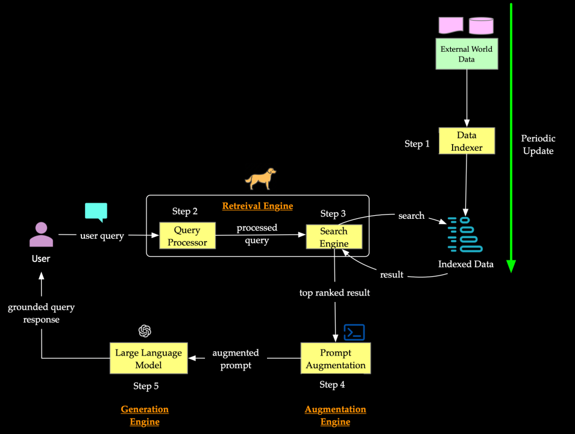
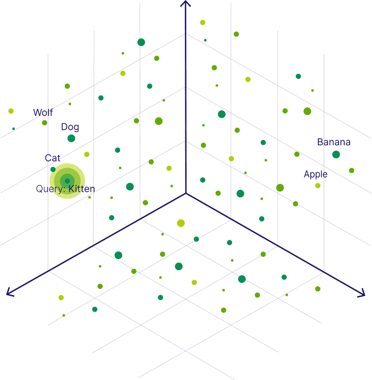
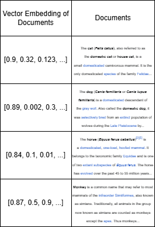

<!--
_paginate: false
_footer: Slides available at https://edspire.aditbala.com/docs/lesson3 
_class: lead invert
-->

# <!--fit--> EdSpire Lecture 04
---
## Retrieval Augmented Generation (RAG)
- Enables LLMs to use external documents and images
- Similar to how you may look in a book or a website to find an answer to a question

---

## Why RAG?
- LLMs are trained on a dataset that quickly becomes outdated
- Example: GPT-4 training data only goes until April 2023
- Why is this an issue?
- LLMs don't perfectly remember and retrieve everything they are trained on
- Why is this an issue?
- RAG solves both issues
---
## RAG Process Outline
- Receive a query (Ex: "What is the weather in Berkeley, CA?")
- Process query
- Search knowledge database for document's matching query
- Select top document
- Augment prompt with content of top document
- Pass augmented prompt to LLM
- 
---
## Processing Query
- Example query: "What is the weather in Berkeley, CA?"
- If you ask ChatGPT, it will first analyze if the query requires RAG	
- The query may have stop words removed (Ex: the, of, is)
- The query may be transformed into a vector (Using the LLM)
---
## Knowledge Database
- A database full of documents that can be referenced for RAG
- This database will be updated periodically to add new documents
- Documents may be indexed by their document vector embeddings (created by passing document through LLM)
---
## Searching the Knowledge Database
- The query will then be used to search for the most relevant document in the database
- Similar to how you may use Google search
- Document may be selected based on key-word matching or vector similarity
---
## Searching the Knowledge Database: Key Word Matching
- Given "What is the weather in Berkeley, CA?"
- Remove stop words: "weather Berkeley CA"
- Use TF-IDF (term frequency-inverse document frequency) or BM25 to score documents based on key word matches with query
- Select document with the highest score
---
## Searching the Knowledge Database: Vector Similarity
- Given "What is the weather in Berkeley, CA?"
- You can remove stop words, but not necessary
- Convert the query into a vector embedding using an LLM
- Use Cosine similarity or a trained language model to score vector similarity between document and query vectors
- Select document with the highest score
- 
---
## Augmenting the Prompt
- Just add the document to the prompt
- EX: "Answer this question: What is the weather in Berkeely, CA?
	Given the following information: [Insert Document]"
- Then input this into an LLM and we're done!

---

## End-To-End Example

- Given query: "Can cat's see in the dark?"
- Knowledge database: 
* Step 1: Remove stop words
	* "cat's see dark?"
 * Step 2: Generate vector embedding: "cat's see dark?" -> vector embedding
 * Step 3: Compute cos similarity between query vector and database document vectors
 	* Cos Sim w/ Doc about cats, Cos Sim w/ Doc about dogs, ...    
 * Step 4: Select document with highest similarity score
 * Step 5: Augment query with selected document
 	* Can cat's see in the dark?  
          Use the following information: [ Document about cats ]
---

## Choosing your projects

- As homework, choose an area of study that interests you, like sports, fitness, langauge
- Think of ML Applications or what you want to build
- Think about how much guidance you want from us?
  - Do you want to build everything yourself with help from us?
  - Do you want us to guide you through the entire process?
  - Something in between?
- Email aditbala@berkeley.edu with your project idea and how much guidance you want

---

#### Some Ideas

- Music Recommender System using Spotify
- [AI Holiday Family Letter](https://family-chatbot.vercel.app/)
- LLM Translation App

